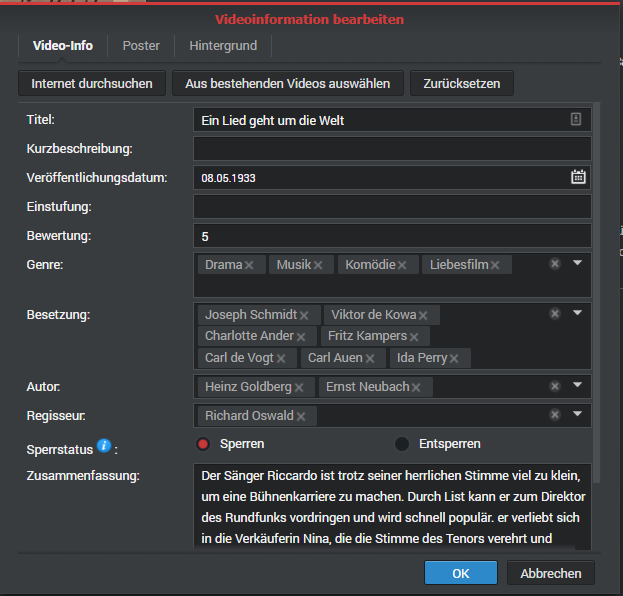

# About VsMetaFileCodec
## Summary
NAS manufacturer [Synology](https://www.synology.com/) provides, for its network attached storage devices (NAS), a video content manager called *Video Station*. The application enables the NAS to stream videos over your LAN. Information about these videos are stored in a local Postgres database and optionally by files with extension *.vsmeta*. The format is proprietary. 
The tool provided here is able to read and write vsMetaFiles. The structure has been elaborated by reverse engineering and resources found [here](https://gist.github.com/soywiz/2c10feb1231e70aca19a58aca9d6c16a). Many thanks to [Carlos Ballesteros Velasco](https://github.com/soywiz).

## Prerequisites
Once a video is written into a directory, *Video Station* looks for *.vsmeta* files if these conditions are met:
* The folder is part of a *Video Station* library.
* At least once, an export of metadata has been triggered. This can be done at the library settings of Video Station.
* The *.vsmeta* file has the same name as the video, appended by *.vsmeta*.
Example: The video is called `video.mpg`, the metadata file shall be named `video.mpg.vsmeta`.
* The *.vsmeta* file is available when *Video Station* indexes the video file first time.
* The content type (movie, series, other) is equal to the type specified in the *.vsmeta* file.

## Limitations
* Media type 'others' is currently not supported.
* All known fields are supported in this version (See list below).

## How to use the code

Here's an example piece of code. Other examples can be found in the unit test classes. Please refer also to [search_check.py](doc/search_check.py).

```python:

    import os
    from datetime import date 
    from vsmetaCodec.vsmetaMovieEncoder import VsMetaMovieEncoder
    from vsmetaCodec.vsmetaInfo import VsMetaInfo
    
    class writeVsMetaForMovie():

        def test_encodeTemplate4(self):

            writer = VsMetaMovieEncoder()

            info = writer.info
            info.showTitle = 'Kino - Filme'
            info.episodeTitle = 'Nach der Hochzeit'
            info.episodeReleaseDate = date(2021, 3, 8)
            info.chapterSummary = 'Um die drohende Schließung seines indischen Waisenhauses abzuwenden...'

            writeVsMetaFile(os.path.join(os.path.dirname(os.path.realpath(__file__)),'videp.mp4.vsmeta'), writer.encode(info))
```

The code will be available on PyPI soon and can be installed with command `pip install vsMetaCodec`.


# Field mapping

Here's how to use the vsMetaInfo class for the different media types.

## Series

To encode the episode of a series, use the `vsMetaInfo` class with a `vsMetaSeriesEncoder`.
Have a look at the test classes to see how it works best. The table below describes how to set the `vsMetaInfo` properties.

| Field in Video Station    | vsMetaInfo property       | Remark                                                                      |
|---------------------------|---------------------------|-----------------------------------------------------------------------------|
| TV Show Name              | `showTitle`               | assign any tv show name as text of type 'str'                               |
| Episode Title             | `episodeTitle`            | assign any text of type 'str'                                               |
| Publishing Date           | `episodeReleaseDate`      | assign any date of type 'date' or 'str' in ISO format                       |
| Season                    | `season`                  | type int: If not set, defaulted with publishing year of episode.            |
| Episode                   | `episode`                 | type int: If not set, defaulted with week no. x 10 + weekday no. (Monday=1) |
| Publishing Date (Episode) | `tvshowReleaseDate`       | assign any date of type 'date' or 'str' in ISO format                       |
| Poster (of Serie)         | `posterImageInfo.image`   | assign a jpg-image as bytestring (the md5-hash is calculated automatically) |
| Locked                    | `episodeLocked`           | assign 'True' if 'VideoStation' may not alter the vsmeta file content       |
| Summary                   | `chapterSummary`          | assign any text of type 'str'                                               |
| Classification            | `classification`          | assign any text of type 'str'                                               |
| Rating                    | `rating`                  | assign any float value in the range of 0.0. to 10.0 or -1.0 for unknown     |
| Cast                      | `list.cast[]`             | append 'actor names' of type 'str' to the list                              |
| Genre                     | `list.genre[]`            | append 'genres' of type 'str' to the list, e.g. 'Drama', 'Action'           |
| Director                  | `list.director[]`         | append 'director names' of type 'str' to the list                           |
| Writer                    | `list.writer[]`           | append 'author names' of type 'str' to the list                             |
| Poster (of Episode)       | `episodeImageInfo.image`  | assign a jpg-image as bytestring (the md5-hash is calculated automatically) |
| Background (of Serie)     | `backdropImageInfo.image` | assign a jpg-image as bytestring (the md5-hash is calculated automatically) |

## Movies

To encode a TV film or movie, use the `vsMetaInfo` class with a `vsMetaMoviesEncoder`.
The property names might be confusing, don't think too much about it - just use them as listed below.

| Field in Video Station    | vsMetaInfo property       | Remark                                                                      |
|---------------------------|---------------------------|-----------------------------------------------------------------------------|
| Title                     | `showTitle`               | assign any title text of type 'str'                                         |
| Short Title               | `episodeTitle`            | assign any short title text of type 'str'                                   |
| Publishing Date           | `episodeReleaseDate`      | assign any date of type 'date' or 'str' in ISO format                       |
| Season                    | `season`                  | N/A - not used, set to 0                                                    |
| Episode                   | `episode`                 | N/A - not used, set to 0                                                    |
| Publishing Date (Episode) | `tvshowReleaseDate`       | N/A - not used, set to 1900-01-01                                           |
| Poster (of Serie)         | `posterImageInfo.image`   | N/A - not used, set to VsImageInfo()                                        |
| Locked                    | `episodeLocked`           | assign 'True' if 'VideoStation' may not alter the vsmeta file content       |
| Summary                   | `chapterSummary`          | assign any text of type 'str'                                               |
| Classification            | `classification`          | assign any text of type 'str'                                               |
| Rating                    | `rating`                  | assign any float value in the range of 0.0. to 10.0 or -1.0 for unknown     |
| Cast                      | `list.cast[]`             | append 'actor names' of type 'str' to the list                              |
| Genre                     | `list.genre[]`            | append 'genres' of type 'str' to the list, e.g. 'Drama', 'Action'           |
| Director                  | `list.director[]`         | append 'director names' of type 'str' to the list                           |
| Writer                    | `list.writer[]`           | append 'author names' of type 'str' to the list                             |
| Poster (of Movie)         | `episodeImageInfo.image`  | assign a jpg-image as bytestring (the md5-hash is calculated automatically) |
| Background (of Movie)     | `backdropImageInfo.image` | assign a jpg-image as bytestring (the md5-hash is calculated automatically) |

## Media type 'other'

This media type is not supported, and probably won't. It is intended for private videos or artwork, which will be edited most likely manually at uploading.

## Screenshots of the property screens for the media types

Here are the screenshots of the supported media types in German English (I did not have English screenshots at hand - please add them if you have).

 

# How to contribute

You're welcome to contribute, but please be aware of ...

* You should provide a unit test for your changes with a good coverage. To do this, install ``nose2`` and ``coverage`` and execute the tests with:

    ```sh
    $ python -m venv venv
    $ source venv/bin/activate
    $ pip install nose2
    $ pip install coverage
    $ nose2 --verbose
    test_encodeTemplate2 (testvsmetaSeriesEncoder.TestVsMetaEncoder.test_encodeTemplate2) ... ok
    test_encodeTemplate3 (testvsmetaSeriesEncoder.TestVsMetaEncoder.test_encodeTemplate3) ... ok
    test_encodeTemplate4 (testvsmetaSeriesEncoder.TestVsMetaEncoder.test_encodeTemplate4) ... ok
    (...)
    ```
* I won't react immediately with checking your pull requests in, but will try to do it within some days.

# References

* Synology Video Station: 
    * [Help in Support Center](https://www.synology.com/en-en/knowledgebase/DSM/help/VideoStation/VideoStation_desc)
    * [Product Page](https://www.synology.com/en-en/dsm/feature/video_station)
