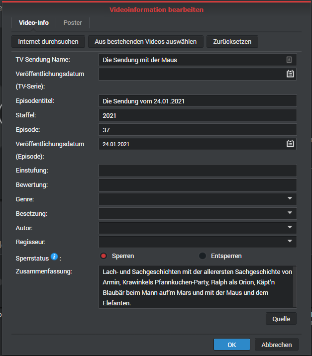

# About VsMetaFileEncoder
## Summary
NAS manufacturer [Synology](https://www.synology.com/) provides, for its network attached storage devices (NAS), a video content manager called *Video Station*. The application enables the NAS to stream videos over your LAN. Information about these videos are stored in a local Postgres database and optionally by files with extension *.vsmeta*. The format is proprietary. 
The tool provided here is able to write vsMetaFiles. The structure has been elaborated by reverse engineering and ressources found [here](https://gist.github.com/soywiz/2c10feb1231e70aca19a58aca9d6c16a). Many thanks to [Carlos Ballesteros Velasco](https://github.com/soywiz).

## Prerequisites
Once a video is written into a directory, *Video Station* looks for *.vsmeta* files if these conditions are met:
* The folder is part of a *Video Station* library.
* At least once, an export of meta data has been triggered. This can be done at the library settings of Video Station.
* The *.vsmeta* file has the same name as the video, appended by *.vsmeta*.
Example: The video is called `video.mpg`, the meta data file shall be named `video.mpg.vsmeta`.
* The *.vsmeta* file is available when *Video Station* indexes the video file first time.
* The content type (movie, series, other) is equal to the type specified in the *.vsmeta* file.

## Limitations
* Media type 'others' is currently not supported.
* Some fields are not yet supported. See list below.

## How to use the code

Here's an example piece of code. Other examples can be found in the unit test classes.

```python:

    import os
    from vsmetaEncoder.vsmetaMovieEncoder import VsMetaMovieEncoder
    from vsmetaEncoder.vsmetaInfo import VsMetaInfo
    
    class writeVsMetaForMovie():

        def test_encodeTemplate4(self):

            writer = VsMetaMovieEncoder()

            info = writer.info
            info.episodeTitle = 'Nach der Hochzeit'
            info.showTitle = 'Kino - Filme'
            info.setEpisodeDate(date(2021, 3, 8))
            info.chapterSummary = 'Um die drohende Schließung seines indischen Waisenhauses abzuwenden...'

            writeVsMetaFile(os.path.join(os.path.dirname(os.path.realpath(__file__)),'videp.mp4.vsmeta'), writer.encode(info))
```

The code is available on PyPI and can be installed with command `pip install vsMetaEncoder`.


# Field mapping

Here's how to use the vsMetaInfo class for the different media types.

## Series

To encode the episode of a series, use the `vsMetaInfo` class with a `vsMetaSeriesEncoder`. Have a look at the test classes to see how it works best. The table below describes how to set the `vsMetaInfo` properties.

Field in Video Station | vsMetaInfo property | Remark
---------------------- | ------------------- | ----------------
TV Show Name           | `showTitle`
Publishing Date        | `setEpisodeReleaseDate()` | Use method instead of direct value assignment.
Episode Title          | `episodeTitle`
Season                 | `season`            | If not set, defaulted with publishing year of episode.
Episode                | `episode`           | If not set, defaulted with week number x 10 plus weekday number (Monday is 1).
Publishing Date (Episode)| `setShowDate()`   | Use method instead of direct value assignment.
Locked                 | `episodeLocked`
Summary                | `chapterSummary`

Not supported yet:

* Classification
* Rating
* Genre
* Cast
* Author

## Movies

To encode a TV film or movie, use the `vsMetaInfo` class with a `vsMetaMoviesEncoder`. The property names might be confusing, don't think too much about it - just use them as listed below.

Field in Video Station | vsMetaInfo property | Remark
---------------------- | ------------------- | ----------------
Title                  | `showTitle`
Short Title            | `episodeTitle`
Publishing Date        | `setEpisodeDate()`   | Use method instead of direct value assignment.
Locked                 | `episodeLocked`
Summary                | `chapterSummary`

Not supported yet: 

* Classification
* Rating
* Genre
* Cast
* Author

## Media type 'other'

This media type is not supported, and probably won't. It is intended for private videos or artwork, which will be edited most likely manually at uploading.

## Screen shots of the property screens for the media types

Here are the screenshots of the supported media types in German English (I did not had English screenshots at hand - please add them if you have).

 

# References

* Synology Video Station: 
    * [Help in Support Center](https://www.synology.com/en-en/knowledgebase/DSM/help/VideoStation/VideoStation_desc)
    * [Product Page](https://www.synology.com/en-en/dsm/feature/video_station)